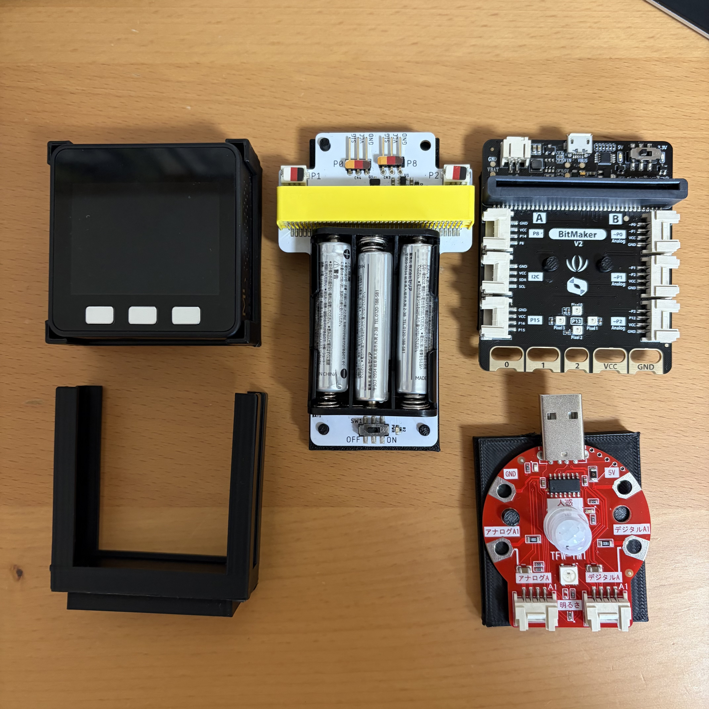

# 3Dプリンタ用データ

このフォルダには、3Dプリンタ用のデータを置いています。

## holder
holderフォルダ以下には、M5Stack、micro:bitなどのシングルボードマイコンやその拡張ボードを固定するためのホルダーを印刷するためのデータが含まれています。

- [M5Stack（横置き）](./holder/m5stack_holder_landscape.stl)
- [M5Stack（縦置き）](./holder/m5stack_holder_portrait.stl)
- [BitMakerV2(micro:bit)](./holder/bitMakerv2_holder.stl)
- [ワークショップモジュール(micro:bit)](./holder/workshop_module_holder.stl)
- [タコラッチ mini](./holder/takoratch_mini_holder.stl)

### Tinkercad link
- [M5Stack holder](https://www.tinkercad.com/codeblocks/5YaQmMsivOH-m5stack-holder)
- [BitMakerV2 holder](https://www.tinkercad.com/codeblocks/cyZdnfB4iBE-bitmakerv2-holder)
- [ワークショップモジュール holder](https://www.tinkercad.com/codeblocks/bCxI8ZnG6FK-workshop-module-holder)
- [タコラッチ mini holder](https://www.tinkercad.com/codeblocks/3XydaaMG5S7-takoratch-mini-holder)

M5Stack holderは以下の変数で、大きさを設定してください。

|変数名|意味|
|:---:|:--|
|length|奥行き（単位：ミリメートル）|
|width|横幅（単位：ミリメートル）|
|height| 高さ（単位：ミリメートル）|

## lego-mount
lego-mountフォルダ以下には、上記ホルダーと組み合わせてLEGOブロックと接続するためのパーツの印刷データを置いています。

- [M5Stack縦置き用](./lego-mount/2x6-LEGO_mount.stl)
- [M5Stack横置き用](./lego-mount/7x7-LEGO_mount.stl)
- [ワークショップモジュール用](./lego-mount/5x12-LEGO_mount.stl)
- [BitMakerV2/タコラッチmini用](./lego-mount/6x7-LEGO_mount.stl)

### Tinkercad link
- [LEGO mount](https://www.tinkercad.com/codeblocks/cPmoyOfcX9K-lego-mount-base)

上記リンク先を開いて、対応させたい大きさを変数で入力すれば、任意の大きさのLEGOマウントを生成できます。

以下の変数で、対応するブロックの突起の数を横・縦それぞれ設定してください。

|変数名|意味|
|:--:|:--|
|stads_count_x|接続するブロックの突起の数（横方向）|
|stads_count_y|接続するブロックの突起の数（縦方向）|
