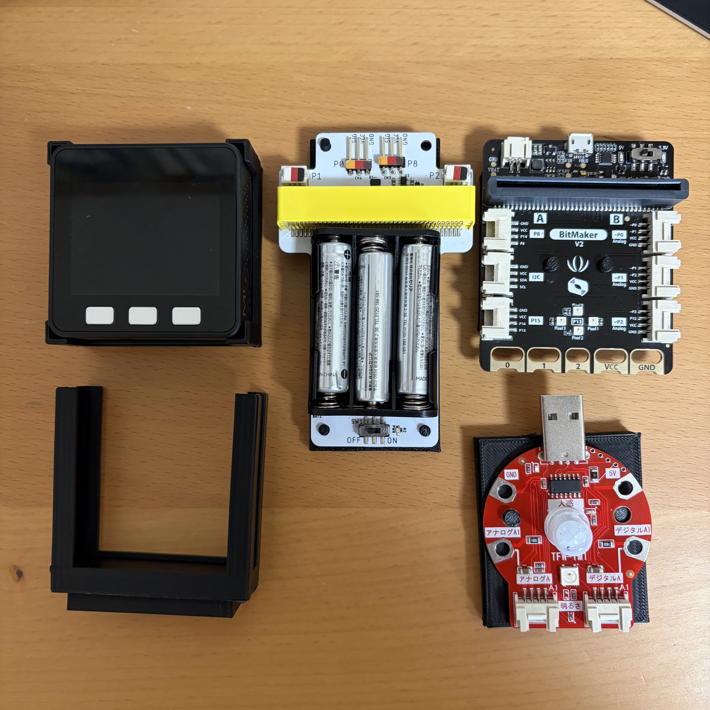

# 3Dプリンタ用データ
make以下には、3Dプリンタ用のデータを置いています。

## 電子工作とLEGOをつなごう
- [M5Stack LEGOホルダー](m5stack_lego)
- [BitMakerV2 LEGOホルダー](bitmakerv2_lego)
- [Akadako LEGOホルダー](akadako_lego)
- [ワークショップモジュール LEGOホルダー](workshop_module_lego)
- [LEGO マウント](lego-mount)

