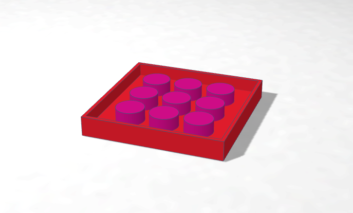
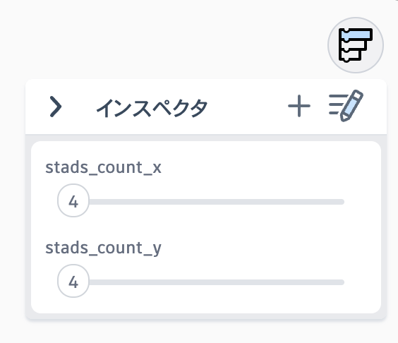

# LEGOマウント

表面は平ら、裏面がLEGブロックの突起に接続できるようになっています。こちらも変数で自由な大きさが作れます。下の画像は6x6のLEGOブロックと接続できるように作ったものです。

[6x6-LEGO_mount.stl](6x6-LEGO_mount.stl)

[プロジェクトを開く（Tinkercad）](https://www.tinkercad.com/codeblocks/cPmoyOfcX9K-lego-mount)

リンク先のプロジェクトのインスペクターの値を変更してください。

各値の意味は以下の通りです、対応するブロックの突起の数を横・縦それぞれ設定してください。

| 値の名前 | 意味 |
| :---: | --- |
| stads_count_x | 接続するブロックの突起の数（横方向） |
| stads_count_y | 接続するブロックの突起の数（縦方向） |
