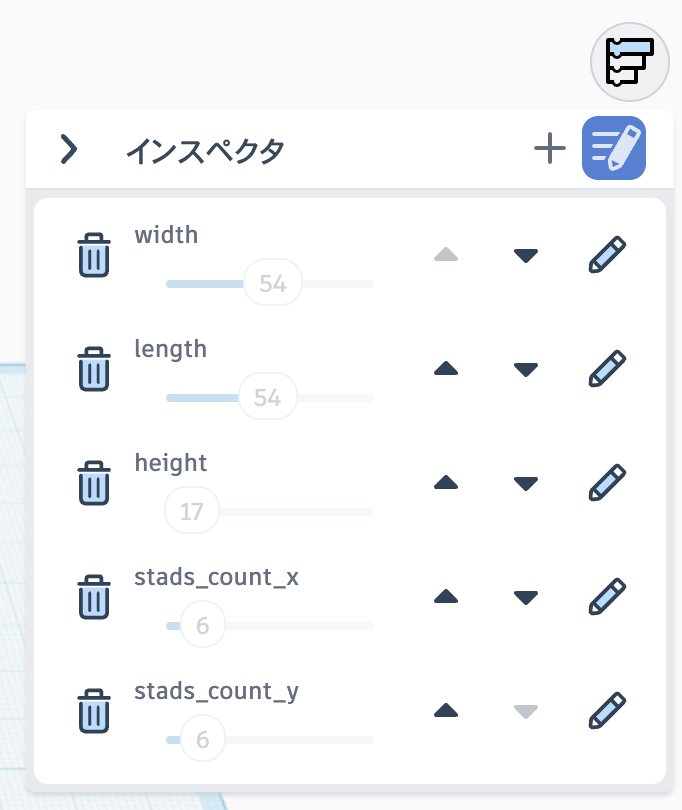

# M5Stack LEGOホルダー

M5StackなどのシングルボードコンピュータとLEGOブロックを接続するためのホルダーを製作しました。

LEGOブロックと組み合わせた電子工作をする時にご利用ください。変数で大きさを指定して作れますので、形状がフィットすればM5Stack以外のデバイスにも使えます。

データは、Tinkercadのコードブロックで作成し公開していますので、変数を変えることで様々な大きさのデバイスに対応できます。

### 3Dプリンター用データ
- [横置き用](M5Stack_LEGO_holder_flat.stl)
- [縦置き用](M5Stack_LEGO_holder_stand.stl)

[プロジェクトを開く（Tinkercad）](https://www.tinkercad.com/codeblocks/99U6cpVFfPQ-m5stack-lego-holder)

リンク先のプロジェクトのインスペクターの値を変更してください。

各値の意味は以下の通りです、対応するブロックの突起の数を横・縦それぞれ設定してください。

| 値の名前 | 意味 |
| :---: | --- |
| length | 奥行き（単位：ミリメートル） |
| width | 横幅（単位：ミリメートル） |
| height | 高さ（単位：ミリメートル） |
| stads_count_x | 接続するLEGOの突起の数（横幅方向） |
| stads_count_y | 接続するLEGOの突起の数（奥行き方向） |

### 応用
デバイスホルダーはM5Stackを想定したシンプルな形状なので、この形状では利用できないデバイスや基板などもあると思います。その場合はホルダー部分だけを別途作成してLEGOマウントと組み合わせてお使いください。
